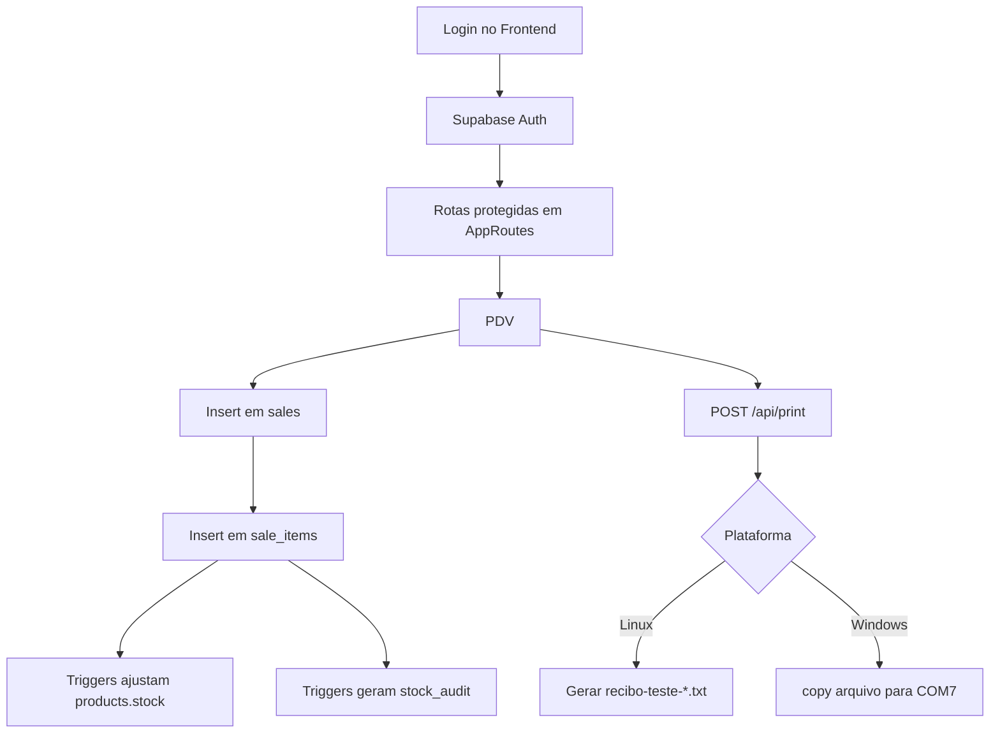
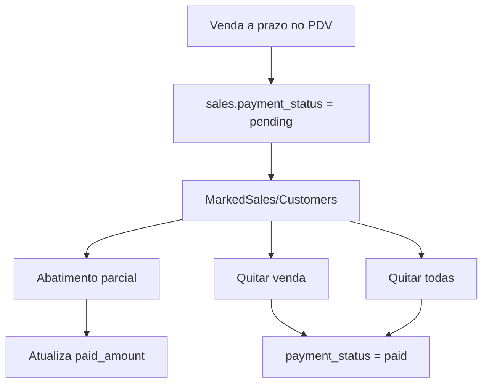

# Diagramas de Fluxo

## Fluxo principal (autenticação, venda e impressão)

```mermaid
flowchart TD
  A[Login no Frontend] --> B[Supabase Auth]
  B --> C[Rotas protegidas em AppRoutes]
  C --> D[PDV]
  D --> E[Insert em sales]
  E --> F[Insert em sale_items]
  F --> G[Triggers ajustam products.stock]
  F --> H[Triggers geram stock_audit]
  D --> I[POST /api/print]
  I --> J{Plataforma}
  J -->|Linux| K[Gerar recibo-teste-*.txt]
  J -->|Windows| L[copy arquivo para COM7]
```

## Fluxo de contas a receber

```mermaid
flowchart TD
  A[Venda a prazo no PDV] --> B[sales.payment_status = pending]
  B --> C[MarkedSales/Customers]
  C --> D[Abatimento parcial]
  C --> E[Quitar venda]
  C --> F[Quitar todas]
  D --> G[Atualiza paid_amount]
  E --> H[payment_status = paid]
  F --> H
```
